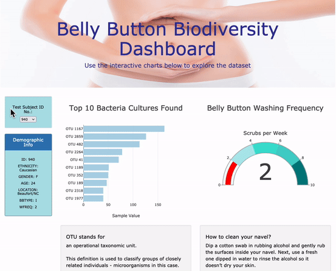

# Belly Button Research
*A JavaScript Interactive Dashboard*
## Project Overview

### Purpose  
The purpose of this project is to create an interactive dashboard which can help the audience better understand the data and draw the same conclusions as researchers and data analyst.  The purpose of this research is to gather, identify, and analyze the biological footprint of individuals’ naval and their unique naval bacteria.   
The research and data file provided holds data of 153 individuals and their: 
-	Unique and anonymous IDs
-	Demographic details
-	Belly button scrubbing frequency
-	Belly button biological “footprint”
-	
### Results
Raw data from the JavaScript array is now presented in a dashboard with a pull down menu to allow the participant and users to see the data.  They can 
do a deep dive into their own results or compare to others participants. The dashboard can be found at the link that follows.  Please try it on your own.   

Belly Button Biodiversity Interactive Dashboard: 

Belly Button Biodiversity Interactive Dashboard:</b> https://jadakai.github.io/Belly_Button_Data/
  

### Background & the Process of Development   
In this development, we used **JavaScript** as the primary coding language along with plotly.js library.  These allow users to access the information without having to install additional programs, such as  **JavaScript**, on their computers in order to run the code. 
JavaScript enables us to create visualizations that are aesthetically pleasing, accessible, and interactive.     

### Resources
 -  The data for the table is stored in a JavaScript array or list named **samples.json**
 -  The table is built by inserting **JavaScript** into **HTML** page. *charts.js*.
 -  **HTML** is used to to build the webpage *index.html*. 
 -  **CSS** and **Bootstrap** then builds and styles the page *style.css*.  
 -  Fire fox Developer Tools are ideal to test the code as we progress through the development.    
 -  Further we use a new Dependency named **D3**. 
 -  Additionally, we deployed the final results of Belly Button Biodiversity Dashboard on **GitHub**

 The link above directs you to an interactive page, so please try it out.  
